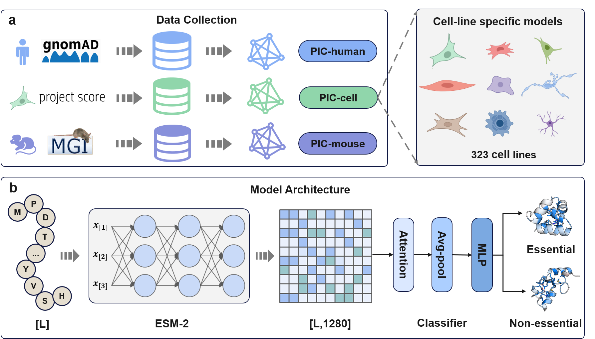

# PIC: Protein Importance Calculator
PIC is a sequence-based deep learning model for comprehensively predicting human protein essentiality, which was mainly bulit by fine-tuning a pre-trained protein language model. 
The PIC web server is now available at http://www.cuilab.cn/




## Publication
[Comprehensive prediction and analysis of human protein essentiality based on a pre-trained protein large language model](https://www.biorxiv.org/content/10.1101/2024.03.26.586900v1)
## Main requirements
* python=3.10.13
* pytorch=1.12.1
* torchaudio=0.12.1
* torchvision=0.13.1
* cudatoolkit=11.3.1
* scikit-learn=1.3.2
* pandas=2.1.1
* numpy=1.26.0
* fair-esm=2.0.0
## Usage
A demo for training a single PIC-cell model using linux-64 platform

**Step1: clone the repo**
```
git clone https://github.com/KangBoming/PIC.git
cd PIC
```

**Step2: create and activate the environment**
```
cd PIC
conda env create -f environment.yml
conda activate PIC
unset LD_LIBRARY_PATH
```

**Step3: download pretrained protein language model**
```
cd pretrained_model
wget http://www.cuilab.cn/pic/static/pic/download/esm2_t33_650M_UR50D.pt
wget http://www.cuilab.cn/pic/static/pic/download/esm2_t33_650M_UR50D-contact-regression.pt
```

**Step4: extract the sequence embedding from raw protein sequences** 

The extracted sequence embeddng will be saved at file folder './result/seq_embedding'
```
cd PIC
python ./code/embedding.py --data_path ./data/cell_data.pkl --fasta_file ./result/protein_sequence.fasta --model ./pretrained_model/esm2_t33_650M_UR50D.pt --label_name A549 --output_dir ./result/seq_embedding --device cuda:0 --truncation_seq_length 1024
```
**Step5: train model**

The trained model will be saved at file folder './result/model_train_results'
```
cd PIC
python ./code/main.py --data_path ./data/cell_data.pkl --feature_dir ./result/seq_embedding --label_name A549 --save_path ./result/model_train_results 
```
Tips: You can set the `label_name` parameter to `human`,`mouse`, or the name of any cell line (you can obtain the name of each cell line from the `data/cell_line_meta_info.csv` file) to train the corresponding PIC model. 

## License
This project is licensed under the MIT License - see the [LICENSE.txt](https://github.com/KangBoming/PIC/blob/main/LICENSE) file for details


## Contact
Please feel free to contact us for any further queations

Boming Kang <kangbm@bjmu.edu.cn>

Qinghua Cui <cuiqinghua@bjmu.edu.cn>


